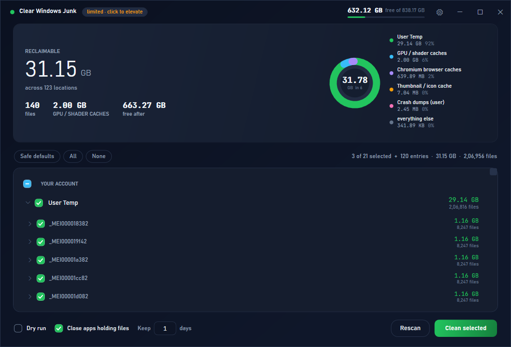
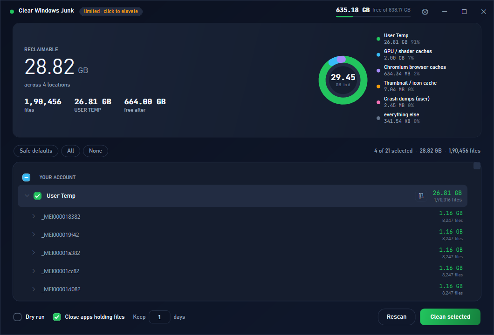
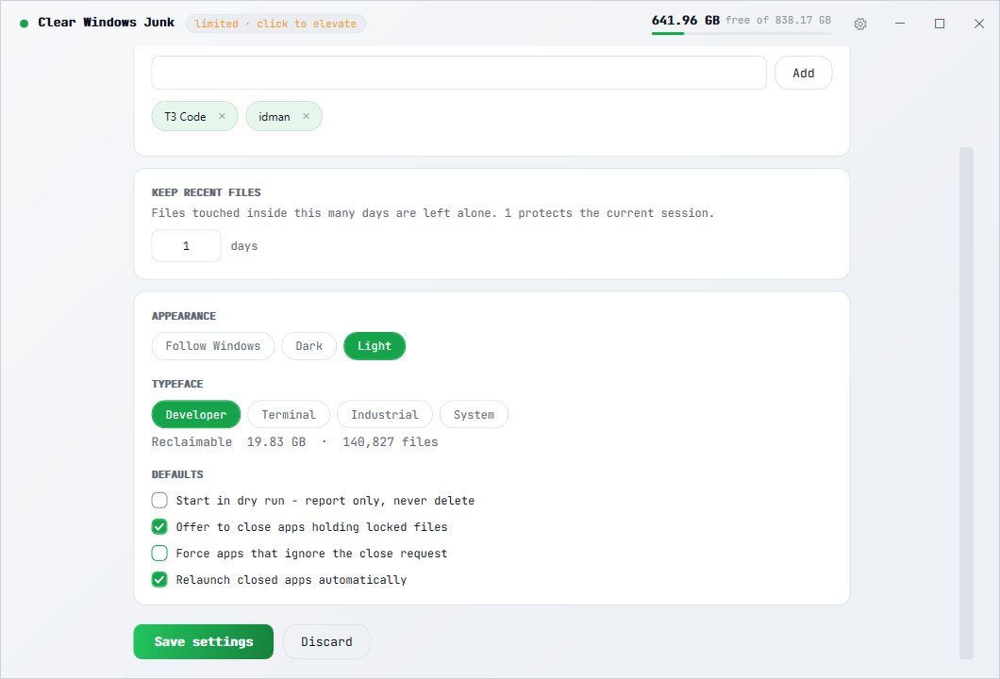

# Clear Windows Junk

A disk cleaner for Windows 11 that shows you exactly what it is about to delete, and
refuses to delete things that would break something.

Ships as two front-ends over the same rules:

| | |
|---|---|
| `Clear Windows Junk.exe` | Desktop app. One file, ~360 KB, no installer, no .NET SDK needed. |
| `Clear-WindowsJunk.ps1` | Console version with a full-screen TUI, for scripting and remote sessions. |



---

## Why this exists

It replaces the `del /s /f /q %temp%` batch file that everyone has. That script had
three problems this one does not:

* It targeted **Windows XP paths** — `system32\dllcache`, `%USERPROFILE%\Local Settings\*`,
  `Cookies`, `Recent`. On Vista and later those are junction points. `del /s` follows
  them and `rd /s` can delete what they point at.
* It used `rd` + `md` on every folder, which **drops the original ACLs and owner**.
* It had no idea what it was deleting or whether anything was still using it.

---

## Download

Grab the latest from the [**Releases** page](https://github.com/AbdulWadudh/clear-windows-junk/releases/latest):

| File | What it is |
|---|---|
| `clear-windows-junk-1.0.0.zip` | **Start here.** All three files, with the executable named `Clear Windows Junk.exe`. |
| `Clear.Windows.Junk.exe` | The desktop app on its own. GitHub substitutes dots for spaces in loose release assets, so rename it to `Clear Windows Junk.exe` after downloading if you want that name in Task Manager. |
| `Clear-WindowsJunk.ps1` | The console/TUI version. |
| `Clear-WindowsJunk.cmd` | Launcher for the `.ps1` — requests admin, keeps the window open on failure. |

Windows SmartScreen will warn on first run because the binary is unsigned — **More info → Run anyway**.
Verify it first if you prefer: `Get-FileHash "Clear Windows Junk.exe"` against the checksums in the release notes.

---

## Quick start

**Desktop app** — double-click `Clear Windows Junk.exe`.

**Console** — double-click `Clear-WindowsJunk.cmd` (not the `.ps1`; Windows opens that
in an editor). The launcher requests admin once, carries on without it if you decline,
and keeps the window open if something fails.

Neither needs to be installed and neither writes anything beside itself unless you ask.

---

## What it cleans

Grouped by what it costs you to lose:

**Your account** — user temp, INetCache, crash dumps, GPU/shader caches,
recent/jump lists, Delivery Optimization cache.

**System** (needs admin) — Windows temp, `C:\Temp`, Windows logs, setup and driver
logs, kernel crash dumps, Windows Error Reporting queues, Defender scan history.

**Advanced** (off by default, each with its consequence spelled out) — Chromium and
Firefox caches, thumbnail cache, Prefetch, Windows Update cache, Delivery
Optimization, upgrade leftovers (`Windows.old`), and the DISM component store.

Every location shows its real measured size before you choose, and a chart shows where
the space actually is.

---

## Expandable breakdown

Any row expands to show what is inside it, folder by folder, each measured
individually and sorted largest first. Children expand recursively.



This is usually how you find the real culprit. On the machine this was built on it
surfaced ~25 GB of `_MEI*` folders — a PyInstaller app leaking a 1.16 GB extraction
directory on every launch.

Tick individual entries to delete just those, or use the hover actions to open a folder
in Explorer or delete one entry outright.

**Selection is honest about scope:**

| Parent | Counts as | Cleans |
|---|---|---|
| Ticked, all children ticked | the whole target | whole target, age-filtered |
| **Partial** (some children cleared) | only the entries still ticked | only those entries |
| Unticked | nothing | nothing |

A ticked child of a fully-ticked parent is *already* inside the parent's total, so it is
never counted twice. Collapsing a partial row clears it rather than silently promoting
it back to "everything".

---

## What it will not do

These are the rules the cleaner never breaks. Most of them exist because the naive
version did the wrong thing first.

**Files are judged individually.** A folder's timestamp says nothing about how fresh
its contents are, so a recursive delete on an old-looking folder would take a file an
app wrote seconds ago. Every file is checked against the cutoff on its own.

**Folders are emptied, never recreated.** Deleting and re-making a folder resets its
ACLs and owner. Contents go, the folder stays.

**Reparse points are skipped, never followed.** A junction inside a temp folder is left
alone rather than becoming a delete of whatever it points at. Sizes are measured the
same way, so what you see is what would be removed.

**Recent files are left alone.** `Keep last N days` defaults to 1, which protects the
current session. It does not apply to an entry you picked out of the breakdown by hand —
you pointed at that one deliberately, and the confirmation says so.

**Empty folders survive if an app might expect them.** A directory is only removed when
it is empty *and* older than the cutoff.

---

## Locked files

Windows refuses to delete a file that something has open. That is the protection doing
its job, and it is what the `pending` column reports.

Tick **Close apps holding files** and the cleaner uses the Windows Restart Manager — the
same API behind Explorer's "this file is open in another program" — to name the exact
processes, then offers to close them:

1. One row per app, with its process count. Nothing pre-ticked; you choose.
2. Graceful close, 20 second grace period.
3. Anything that ignores the request gets a second prompt before being forced.
4. A final prompt to relaunch what was closed.

**Only the window owner is ever signalled.** Chrome's renderers are children — killing
one gives you a crashed-tab page instead of a clean shutdown. Children are never
force-killed; they follow their parent out.

**It cannot close these**, whatever they are holding:

* Anything Restart Manager marks critical, and any service
* `lsass`, `svchost`, `csrss`, `winlogon`, `services`, `dwm`, `MsMpEng`,
  `TrustedInstaller`, `conhost`, `powershell`, `cmd` and friends
* **The process tree that launched it** — your shell, terminal or editor, found by
  walking the parent chain. A name list cannot know you are driving `bash.exe` or
  a particular editor, so this is done by PID lineage.
* Anything on your own never-close list

If you launch the app from Explorer, your editor genuinely is not in its process tree —
add it to the never-close list in Settings.

---

## Settings



Theme (follow Windows / dark / light), typeface, keep-recent days, never-close apps, and
defaults for unlock / force / relaunch / dry run.

**Storage** — by default settings live in the app's own store under
`HKCU\Software\ClearWindowsJunk`, so the `.exe` stays a single portable file with
nothing dropped beside it. Tick **Portable** and it writes
`Clear-WindowsJunk.settings.txt` next to the executable instead; that file wins when
present, and it is what lets the PowerShell version share one config.

```ini
Theme = system
FontPair = developer
MinAgeDays = 1
Unlock = false
ForceClose = false
Restart = false
NeverCloseApp = T3 Code, idman
```

### Keyboard

`F5` rescan · `Ctrl+Enter` clean · `Ctrl+A` / `Ctrl+D` select all / none ·
`Ctrl+,` settings · `Esc` back or cancel

---

## Console version

Run with no arguments for the interactive TUI; pass any switch for unattended use.

```powershell
.\Clear-WindowsJunk.ps1                      # interactive checklist
.\Clear-WindowsJunk.ps1 -DryRun              # report only, delete nothing
.\Clear-WindowsJunk.ps1 -Unlock              # close apps holding locked files
.\Clear-WindowsJunk.ps1 -All -NonInteractive -MinAgeDays 1
```

| Switch | Effect |
|---|---|
| `-MinAgeDays <n>` | Keep files touched in the last n days. Default 1. |
| `-DryRun` | Measure and report, delete nothing. |
| `-Unlock` | Offer to close apps holding locked files. |
| `-ForceClose` | Kill apps that ignore the close request. |
| `-Restart` | Relaunch closed apps without asking. |
| `-NeverCloseApp a,b` | Names to never close. |
| `-IncludeBrowserCache`, `-IncludeThumbnails`, `-IncludePrefetch`, `-IncludeWindowsUpdate`, `-IncludeWindowsOld`, `-IncludeComponentStore` | Opt into the advanced targets. |
| `-All` | All of the above advanced targets. |
| `-NonInteractive` | No prompts. |
| `-SelfTest` | Run the assertions and exit. |

---

## Testing

Both front-ends carry their own assertions, and the guards above are covered rather
than assumed.

```powershell
& ".\Clear Windows Junk.exe" --selftest     # 65 checks
.\Clear-WindowsJunk.ps1 -SelfTest
```

They cover the age filter sparing a fresh file inside a stale folder, junctions not
being traversed or deleted through, the folder skeleton surviving, single-entry delete,
the breakdown coverage rule, settings round-trips in both storage modes, and every
refusal in the close gate.

> The PowerShell `-SelfTest` originally printed `SelfTest OK` unconditionally:
> `$ErrorActionPreference = 'SilentlyContinue'`, needed by the delete loops, also
> swallows `throw`. It is pinned to `Stop` inside the test block now, and the assertions
> were mutation-checked — break the code and the test fails.

---

## Building

See [BUILD.md](BUILD.md). Short version: run `app\build.cmd`. It uses the C# compiler
that already ships with Windows — no SDK, no NuGet, no project file.

---

## Requirements

Windows 10 or 11 with .NET Framework 4.x (present on every stock install).
Administrator rights are only needed for the system targets; everything else works
without them.
